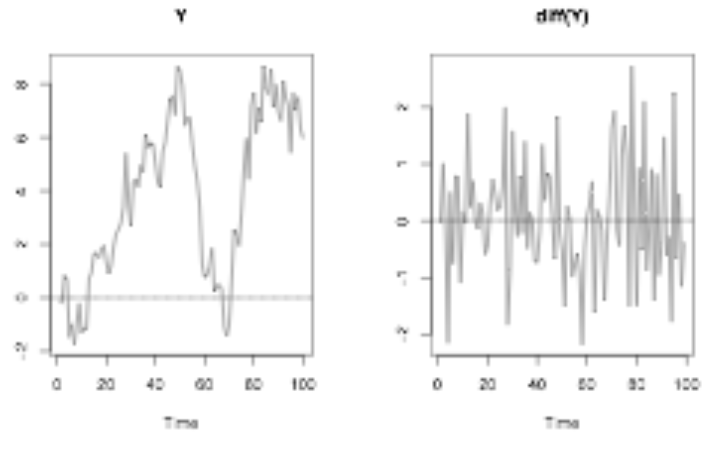

```{r setup, include=FALSE}
knitr::opts_chunk$set(echo = TRUE)

library(weatherData)
library(dplyr)
library(xts)
```

## Removing trends in variability via the logarithmic transformation

{width=50%}
 
{width=50%}

## Removing trends in level by differencing

Differencing with the `diff()` function can give us the increments in trends over time or any type of change in a time series. 

```{r}
london <- as.xts(x = London2013$Temperature,
                 order.by = lubridate::as_datetime(London2013$Time)) 

periodicity(london)
```

`diff()` as a default gives 1 lag (differences between 1 observations)

```{r}
head(diff(london))
```

## Removing seasonal trends with seasonal differencing

Sometimes we are not interested in the seasonal fluctuations in the data but interested in the yearly changes overall. In such cases, we can get the differences with the lag of 12 in a montly dataset (substracting each month's value from the next year's month value) and 4 in a quarterly dataset.  

Original monthly driver deaths

```{r}
MASS::drivers |> 
  as.xts() |> 
  ts.plot()
```

Drivers death data with a lag of 12 (same montly data has been substracted by each year)

```{r}
MASS::drivers |> 
  as.xts() |> 
  diff(lag = 12) |> 
  ts.plot()
```

## The white noise (WN) model

Simplest example of a stationary process with no clear pattern or a trend over time. A weak white noise process has:

* A fixed, constant mean
* A fixed, constant variance
* No correlation over time

{width=40%}  


## ARIMA: AutoRegressive, Integrated Moving Average

We can use ARIMA models to specify white noise (WN) models.

```{r}
# Stimulate a WN model with 50 obervations
WN <- arima.sim(model = list(order = c(0,0,0)),
                n = 50)
# This series has a default value of mean 0 and sd 1
head(WN)
ts.plot(WN)
```

```{r}
# Set the mean and sd of a stimulated WN model
WN_1 <- arima.sim(model = list(order =  c(0,   #Autoregressive order
                                          0,   #Order of integration (differencing)
                                          0)), #Moving average order
                  n = 50,
                  mean = 4,
                  sd = 2)

ts.plot(WN_1)
```

### Estimating the white noise in a time series

```{r}
arima(WN_1, 
      order = c(0,0,0))

mean(WN_1)

var(WN_1)
```

## The random walk (RW) model

A basic time series model and a simple example of an unstable (non-stationary) process. They are the cumulative sum (1st obs, 1st + 2nd obs, 1st + 2nd + 3rd obs, ...) of a mean zero white noise series. Therefore, first difference (lag 1) gives a WN model. Also, RW models are ARIMA(0,1,0) models, which 1 indicates the integration is 1. The have:

* No specified mean or variance
* Exhibit strong dependence over time (each observation is strongly related to its immediate neighbors)
* Its changes or increments are (similar to) white noise, which means the change is stable/stationary 

Some RW time series plots:

{width=60%}

RW recursion:  

> Today (Yt) = Yesterday (Yt - 1) + Noise (Et)

The error (Et as noise) means zero white noise. This variance in the WN model's error is the only parameter of RW.

First difference (lag 1) series logically becomes:

> Et = Yt - Yt-1 (equals to diff(Y), which in itself unwinds to a WN series)

{width=50%}  

## Random walk with a drift 

RW models with a constant of drift, which means a drifting or trending of values upwards or downwards over time.  

> Today = Yesterday + Noise + Constant (c, which works as the slope in the graph)   

This type of RW model increases its parameter size to 2, with a constant c and a WN variance Et. This is because if you are getting the cumulative sum of a data with a mean of 0, the data is scattered around positive and negative values (depending on the variance) and therefore summing the values results in a somewhat stale model. Whereas if the mean is like 5, since the values will mostly be positive, the trend drifts upward and if the mean is -5, the trend drifts downwards.  

The first difference (lag 1) of a RW with a drift is Yt - Yt-1 = WN series (process) with a mean as the c of the constant (i.e., constant + noise in a WN model). In another words, unwinding the cumulative sum from the RW model gets the core data/model of WN. Therefore, if we create a WN process with a mean other than 0 and then get its cumulative sum, we get a RW process/model.

{width=50%}

### Stimulating a random walk model

```{r}
RW <- arima.sim(model = list(order = c(0,    #Autoregressive order
                                       1,    #Order of integration (differencing)
                                       0)),  #Moving average order
                n = 100)                     #100 observations

ts.plot(RW)
```

```{r}
RW_diff <- diff(RW)

plot(RW_diff)
```

### Stimulating a random walk model with a drift

```{r}
RW_drift <- arima.sim(model = list(order = c(0,
                                             1,
                                             0)),
                      n = 100,
                      mean = .5)

plot(RW_drift)
```

```{r}
RW_drift_diff <- diff(RW_diff)

ts.plot(RW_drift_diff)
```

## Stationary processes

Stationary processes have distributional inveriance (stability) over time. For observed time series, fluctuations appear random and these random fluctuations behave similarly from one time period to the next. For example, stocks or returns from interests have different behavior from the previous year but their mean, sd, or other statistics are somewhat similar from one year to the next.

* Weak stationarity: Mean, variance, covariance are constant over time.
  + Mean and variance Yt is the same (constant) for all times (t).
  + Covariance of Y at the time t (Yt) and Ys is constant for all times as t - s = h, meaning the covariance between these times depend on how close these two time points are.
    - Cov(Y2, Y5) = Cov(Y7, Y10)

Stationary models (aka processes) can be modeled with relatively fewer parameters; there is no need for a different mean for the observation at the time t (Yt), all times have a common mean which is the mean of the sample. 

Many financial time series do not exhibit stationarity but the changes in the series are often approximately stationary (constant), meaning the change is relatively the same throughout time.  

A stationary series showS some oscillation around some fixed level (mean), which is called *mean-reversion*. For example, the inflation rates do not naturally come down to a specific level due to being controlled by monetary policies. But the changes in inflation rates show a clear mean-reversion to the mean of 0, as policies increase the rate at times and decrease at others. 

{width=50%}  

There are many commonly encountered departures (deviances) from stationarity, including time trends, periodicity, and a lack of mean reversion.

{width=65%}  

WN models are stationary but the RW models are always non-stationary, both with and without a drift.

```{r}
#Basic WN model
WN <- arima.sim(model = list(order = c(0,
                                       0,
                                       0)),
                n = 100)

#Basic RW model
RW <- cumsum(WN)


#WN model with a drift (mean other than 0)
WN_drift <- arima.sim(model = list(order = c(0,
                                             0,
                                             0)),
                      n = 100,
                      mean = 0.4)

#Get the cumsum of the WN model with a drift
RW_drift <- cumsum(WN_drift)
```

Plotting the models comparatively

```{r}
plot.ts(cbind(WN, RW, WN_drift, RW_drift))
```

