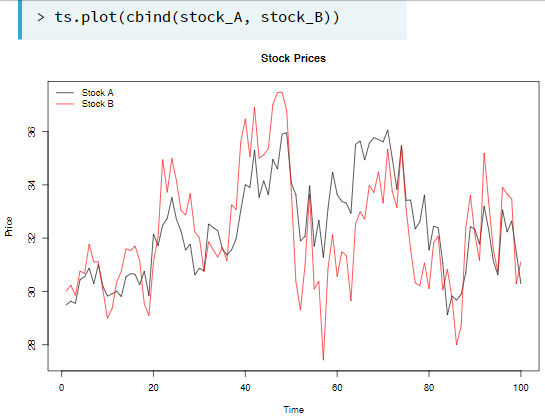
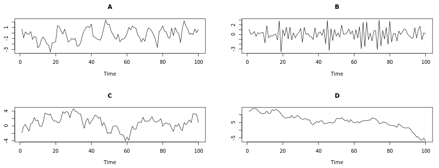

```{r setup, include=FALSE}
knitr::opts_chunk$set(echo = TRUE)
```

# Correlation analysis and the autocorrelation function

## Scatterplots

{width=50%}

Instead of doing a time plot, we can compare the price values lets say two stocks in a scatter plot by stock A on the y axis and stock B on the x axis. This allows us to evaluate the relationship between these stock price.  

{width=50%}

Financial asset returns: Channges in price as a fraction of the initial price over a given time (e.g., a week)  

Taking the log of a stock option shows us the percentage of increase/decrease in the returns. If the stock goes from 1 to 2, this is a %100 increase, while if it goes from 2 to 3, this increase is %50. In linear analyses, these two have just 1 unit of increase. With the log analyses, we can see the relative value of the returns, especially important for long term trend analyses (like years).

```{r}
plot.ts(cbind(EuStockMarkets, log(EuStockMarkets)))
```

```{r}
# getting the daily returns
## Divide all rows except the first and the last one and subtract 1 from the values
returns <- EuStockMarkets[-1,] / EuStockMarkets[-1860,] - 1

# We'll see that this formula does the same thing as diff(log(x))

#convert the returns to time series
returns <- ts(returns, 
              start = c(1991, 130),
              frequency = 260)

# diff(log(EuStockMarkets)) is the log of returns
plot(cbind(returns, diff(log(EuStockMarkets))))

```

```{r}
colMeans(returns)

apply(returns, #apply in the data
      MARGIN = 2,     #in columns (1 would be rows)
      FUN = var)      #the var function (variance)

apply(returns,
      MARGIN = 2,
      FUN = sd)
```

```{r results='hide'}
par(mfrow = c(2,2))
apply(returns, MARGIN = 2, FUN = hist, main = "", xlab = "Return")
```

```{r results='hide'}
par(mfrow = c(2,2))
apply(returns,
      MARGIN = 2,
      FUN = qqnorm,
      main = "")
```

```{r}
pairs(EuStockMarkets)
```

```{r}
plot(diff(log(EuStockMarkets)),
     main = "Log Daily Returns")
```

```{r}
pairs(diff(log(EuStockMarkets)),
      main = "Log Daily Returns")
```

## Covariance and correlation

**Covariance** means to what degree two variables sync their movement (e.g., increase or decrease) in the values. For time series analysis, this syncronization is investigated at certain time points while for behavior, it is investigated by enough number of people showing eleveted scores for an attribute. The covariance coefficient depends on the scale of the variables (i.e., how big or small the values are).  

**Correlation** is a standardized version of covariance which does not depend on the scale of the measurements in the variables. 

> Correlation = cov(stock_A, stock_B) / (sd(stock_A) * sd(stock_B))

{width=50%}  

## Autocorrelation

Autocorrelation means correlation analysis is done for a large number of variables in an efficient way. Lag 1 autocorrelation means the correlation of a stock prices between all consecutive days (today vs yesterday). It can be used to see if a time series is dependent on its past.

```{r}
# acf() gives the autocorrelation for each lag, plot can be set to F to get only the values
# Blue lines represent %95 confidence intervals

acf(EuStockMarkets[,1], lag.max = 500, plot = T)
```

# Autoregression

## The autoregressive (AR) model

AR model arguably the most widely used time series model. It is like a simple linear regression but each observation is regressed on the previous observation. This makes them a simple first order recursion processes by regressing today's observation on yesterday's observation. Additionally, WN and RW models are included in AR models as special case models. 

> Today = Slope * Yesterday + Constant + Noise

In R, we use with he mean centered version of the AR recursion.

> (Today - Mean) = Slope * (Yesterday - Mean) + Noise

> $$Y_{t} - \mu = \phi * (Y_{t-1} - \mu) + \epsilon_{t}$$

$$\epsilon_{t}$$ is the white noise (WN) with a mean zero (non-zero mean WN would be a RW).

$$\phi$$ is the slope parameter valued between -1 and 1. 

If the AR process's slope $$\phi = 0$$, then $$Y_{t} = \mu + \epsilon_{t}$$ which is a WN process. If it is $$\phi \neq 0$$, then $$Y_{t}$$ depends on both the error $$\epsilon_{t}$$ and the previous observation $$Y_{t-1}$$. Large values of the slope $$\phi$$ lead to greater autocorrelation and negative values of $$\phi$$ result in oscillatory time series.

{width=80%}  

{width=80%}  
If the mean $$\mu = 0$$ and the slope $$\phi = 1$$, then $$Y_{t} = Y_{t-1} + \epsilon_{t}$$, which is Today = Yesterday + Noise. This is a RW process in which the $$Y_{t}$$ is not stationary.

### Simulating a autoregressive model

```{r}
# ar is the phi (the slope) of the time series model
AR_50 <- arima.sim(model = list(ar = .5),
                  n = 100)

AR_90 <- arima.sim(model = list(ar = .9),
                   n = 100)

AR_neg75 <- arima.sim(model = list(ar = -.75),
                   n = 100)

plot(cbind(AR_90, AR_50, AR_neg75),
     main = "As the slope (phi) decreases, oscilattion of the process increase \n and autocorrelation (continuity from one obs to the next) decreases")
```

We can check the autocorrelation for AR models with differing slopes, like the one above. We can see that higher the slope (phi) of the AR model, higher autocorrelation. Furthermore, the negative phi value creates an alternating pattern between positive and negative values.

```{r}
par(mfrow = c(2,2))
acf(AR_90)
acf(AR_50)
acf(AR_neg75)
```

Persistence is defined by a high correlation between an observation and its lag, while anti-persistence is defined by a large amount of variation between an observation and its lag. IN the AR model, when the slope (phi) parameter approaches 1, the persistance increases but the process reverts to its mean quickly. Also, the ACF decays to zero at a quick rate, indicating that values far in the past have little impact on future values of the process.

{width=50%}  

### Comparing the random walk (RW) and autoregressive (AR) models

RW is a special case of AR model, which has a slope (phi) value of 1. RW has the attribute of being non-stationary but it exhibits very strong persistence. The autocovariance function (ACF) decays to zero very slowly, meaning past values have a long lasting impact on current values.

```{r}
par(mfrow = c(3,2))
# Simulate and plot AR model with slope 0.9 
AR_90 <- arima.sim(model = list(ar = 0.9), n = 200)
ts.plot(AR_90)
acf(AR_90)

# Simulate and plot AR model with slope 0.98
AR_98 <- arima.sim(model = list(ar = 0.98), n = 200)
ts.plot(AR_98)
acf(AR_98)

# Simulate and plot RW model
RW <- arima.sim(model = list(order=c(0,1,0)), n = 200)
ts.plot(RW)
acf(RW) 
```

## AR model estimation and forecasting


