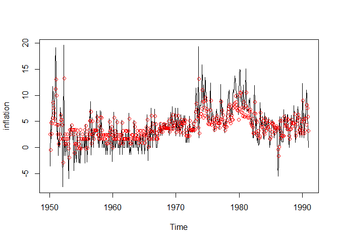

3_Correlation analysis and the autocorrelation function
================
IO
4/20/2022

-   [Correlation analysis and the autocorrelation
    function](#correlation-analysis-and-the-autocorrelation-function)
    -   [Covariance and correlation](#covariance-and-correlation)
    -   [Autocorrelation](#autocorrelation)
-   [Autoregression](#autoregression)
    -   [The autoregressive (AR) model](#the-autoregressive-ar-model)
        -   [Simulating a autoregressive
            model](#simulating-a-autoregressive-model)
        -   [Comparing the random walk (RW) and autoregressive (AR)
            models](#comparing-the-random-walk-rw-and-autoregressive-ar-models)
    -   [AR model estimation and
        forecasting](#ar-model-estimation-and-forecasting)
-   [Moving Average](#moving-average)
    -   [The simple moving average
        model](#the-simple-moving-average-model)
    -   [Simulating a simple moving average
        model](#simulating-a-simple-moving-average-model)
    -   [Compare AR and MA models](#compare-ar-and-ma-models)

# Correlation analysis and the autocorrelation function

Financial asset returns: Changes in price as a fraction of the initial
price over a given time (e.g., a week)

Taking the log of a stock option shows us the percentage of
increase/decrease in the returns. If the stock goes from 1 to 2, this is
a %100 increase, while if it goes from 2 to 3, this increase is %50. In
linear analyses, these two have just 1 unit of increase. With the log
analyses, we can see the relative value of the returns, especially
important for long term trend analyses (like years).

``` r
plot.ts(cbind(EuStockMarkets, log(EuStockMarkets)))
```

<!-- -->

``` r
# getting the daily returns
## Divide all rows except the first and the last one and subtract 1 from the values
returns <- EuStockMarkets[-1,] / EuStockMarkets[-1860,] - 1

# We'll see that this formula does the same thing as diff(log(x))

#convert the returns to time series
returns <- ts(returns, 
              start = c(1991, 130),
              frequency = 260)

# diff(log(EuStockMarkets)) is the log of returns
plot(cbind(returns, diff(log(EuStockMarkets))))
```

<!-- -->

``` r
colMeans(returns)
```

    ##          DAX          SMI          CAC         FTSE 
    ## 0.0007052174 0.0008609470 0.0004979471 0.0004637479

``` r
apply(returns,        #apply in the data
      MARGIN = 2,     #in columns (1 would be rows)
      FUN = var)      #the var function (variance)
```

    ##          DAX          SMI          CAC         FTSE 
    ## 1.056965e-04 8.523711e-05 1.215909e-04 6.344767e-05

``` r
apply(returns,
      MARGIN = 2,
      FUN = sd)
```

    ##         DAX         SMI         CAC        FTSE 
    ## 0.010280879 0.009232394 0.011026827 0.007965405

``` r
par(mfrow = c(2,2))
apply(returns, MARGIN = 2, FUN = hist, main = "", xlab = "Return")
```

<!-- -->

``` r
par(mfrow = c(2,2))
apply(returns,
      MARGIN = 2,
      FUN = qqnorm,
      main = "")
```

<!-- -->

``` r
pairs(EuStockMarkets)
```

<!-- -->

``` r
plot(diff(log(EuStockMarkets)),
     main = "Log Daily Returns")
```

<!-- -->

``` r
pairs(diff(log(EuStockMarkets)),
      main = "Log Daily Returns")
```

<!-- -->

## Covariance and correlation

**Covariance** means to what degree two variables sync their movement
(e.g., increase or decrease) in the values. For time series analysis,
this syncronization is investigated at certain time points. The
covariance coefficient depends on the scale of the variables (i.e., how
big or small the values are).

**Correlation** is a standardized version of covariance which does not
depend on the scale of the measurements in the variables.

> Correlation = cov(stock_A, stock_B) / (sd(stock_A) \* sd(stock_B))

<figure>
<figcaption aria-hidden="true">Covariance and scatterplot</figcaption>
</figure>

## Autocorrelation

Autocorrelation means correlation analysis is done for a large number of
variables in an efficient way. Lag 1 autocorrelation means the
correlation of a stock prices between all consecutive days (today vs
yesterday, yesterday vs the-other-day,…). It can give us some
information about whether a series is dependent on its past or not.

``` r
# acf() gives the autocorrelation for each lag, plot can be set to F to get only the values
# Blue lines represent %95 confidence intervals

acf(EuStockMarkets[,1], lag.max = 500, plot = T)
```

<!-- -->

# Autoregression

## The autoregressive (AR) model

AR model is arguably the most widely used time series model. It is like
a simple linear regression but each observation is regressed on the
previous observation. This makes them a simple first order recursion
processes by regressing today’s observation on yesterday’s observation.
Additionally, WN and RW models are special cases of AR models.

AR recursion:

> Today = Slope \* Yesterday + Constant + Noise

AR recursion, mean centered version (as used in R):

> (Today - Mean) = Slope \* (Yesterday - Mean) + Noise

> (*Y*<sub>*t*</sub>−*μ*) = *ϕ* \* (*Y*<sub>*t* − 1</sub>−*μ*) + *ϵ*<sub>*t*</sub>

*ϵ*<sub>*t*</sub>
is the white noise (WN) with a mean zero.

*ϕ*
is the slope parameter valued between -1 and 1.

If the AR process’s slope
*ϕ* = 0
, then
*Y*<sub>*t*</sub> = *μ* + *ϵ*<sub>*t*</sub>
which is a WN process. If it is
*ϕ* ≠ 0
, then
*Y*<sub>*t*</sub>
depends on both the error
*ϵ*<sub>*t*</sub>
and the previous observation
*Y*<sub>*t* − 1</sub>
. Large values of the slope
*ϕ*
lead to greater autocorrelation and negative values of
*ϕ*
result in oscillatory time series.

<figure>
<figcaption aria-hidden="true">(1 &amp; 3) phi is ~1 and each observation is close to its neighbors, meaning they show strong persistance (not oscillating too much) in level (2) phi is negative, shows oscillatory patterns, (4) so much dependence, the series quickly diverging downward</figcaption>
</figure>

  
If the mean
*μ* = 0
and the slope
*ϕ* = 1
, then
*Y*<sub>*t*</sub> = *Y*<sub>*t* − 1</sub> + *ϵ*<sub>*t*</sub>
, which is Today = Yesterday + Noise. This is a RW process in which the
*Y*<sub>*t*</sub>
is not stationary.

### Simulating a autoregressive model

``` r
# ar is the phi (the slope) of the time series model
AR_50 <- arima.sim(model = list(ar = .5),
                  n = 100)

AR_90 <- arima.sim(model = list(ar = .9),
                   n = 100)

AR_neg75 <- arima.sim(model = list(ar = -.75),
                   n = 100)

plot(cbind(AR_90, AR_50, AR_neg75),
     main = "As the slope (phi) decreases, oscilattion of the process increase \n and autocorrelation (continuity from one obs to the next) decreases")
```

<!-- -->

We can check the autocorrelation for AR models with differing slopes,
like the one above. We can see that higher the slope (phi) of the AR
model, higher autocorrelation. Furthermore, the negative phi value
creates an alternating pattern between positive and negative values.

``` r
par(mfrow = c(2,2))
acf(AR_90)
acf(AR_50)
acf(AR_neg75)
```

<!-- -->

Persistence is defined by a high correlation between an observation and
its lag, while anti-persistence is defined by a large amount of
variation between an observation and its lag. IN the AR model, when the
slope (phi) parameter approaches 1, the persistance increases but the
process reverts to its mean quickly. Also, the ACF decays to zero at a
quick rate, indicating that values far in the past have little impact on
future values of the process.

<figure>
<figcaption aria-hidden="true">D shows the highest degree of persistence, with a clear downward trend</figcaption>
</figure>

### Comparing the random walk (RW) and autoregressive (AR) models

RW is a special case of AR model, which has a slope (phi) value of 1. RW
has the attribute of being non-stationary but it exhibits very strong
persistence. The autocovariance function (ACF) decays to zero very
slowly, meaning past values have a long lasting impact on current
values.

``` r
par(mfrow = c(3,2))
# Simulate and plot AR model with slope 0.9 
AR_90 <- arima.sim(model = list(ar = 0.9), n = 200)
ts.plot(AR_90)
acf(AR_90)

# Simulate and plot AR model with slope 0.98
AR_98 <- arima.sim(model = list(ar = 0.98), n = 200)
ts.plot(AR_98)
acf(AR_98)

# Simulate and plot RW model
RW <- arima.sim(model = list(order=c(0,1,0)), n = 200)
ts.plot(RW)
acf(RW) 
```

<!-- -->

## AR model estimation and forecasting

We’ll use the US inflation data from 1950 to 1990.

``` r
par(mfrow = c(1,2))

inflation <- as.ts(Ecdat::Mishkin[,1])

ts.plot(inflation)

acf(inflation)
```

<!-- -->

``` r
# Fitting an AR model to the inflation data

AR_inflation <- arima(inflation,
                      order = c(1,  
                                0,
                                0))

print(AR_inflation)
```

    ## 
    ## Call:
    ## arima(x = inflation, order = c(1, 0, 0))
    ## 
    ## Coefficients:
    ##          ar1  intercept
    ##       0.5960     3.9745
    ## s.e.  0.0364     0.3471
    ## 
    ## sigma^2 estimated as 9.713:  log likelihood = -1255.05,  aic = 2516.09

The slope
*ϕ*
is 0.596, the mean
*μ*
is 3.974, and the sigma^2 estimate (the innovation variance) is 9.713.

AR fitted values:

The prediction estimates of today given yesterday

> $$\\hat{Today} = \\hat{Mean} + \\hat{Slope} \* (Yesterday - \\hat{Mean})$$

> $$\\hat{Y\_{t}} = \\hat{\\mu} + \\hat{\\phi} \* (Y\_{t-1} - \\hat{\\mu})$$

Residuals of the fitted AR model:

Today (the observed values) - the estimates of today equals to error in
the model’s estimate. The residuals in the AR model are estimates of a
WN process.

> $$\\hat{\\epsilon{t}} = Y\_{t} - \\hat{Y\_{t}}$$

``` r
# We find the residuals by applying the above formula, which is observed - fitted values

AR_inflation_residuals <- inflation - residuals(AR_inflation)


ts.plot(inflation)
points(AR_inflation_residuals, 
       tpye = "l",
       col = "red",
       lty = 2)
```

    ## Warning in plot.xy(xy.coords(x, y), type = type, ...): "tpye" is not a graphical
    ## parameter

<!-- -->

We see that the AR model explains the variation observed in the
inflation time series, meaning it encompasses the residuals within the
model variance.

To predict one data point forward from the AR model, we can use the
`predict()` function.

``` r
predicted_infation <- predict(AR_inflation)
predicted_infation$pred[1]
```

    ## [1] 1.605797

``` r
# Predict 6 months ahead
predict(AR_inflation, n.ahead = 6)$pred
```

    ##           Jan      Feb      Mar      Apr      May      Jun
    ## 1991 1.605797 2.562810 3.133165 3.473082 3.675664 3.796398

``` r
# The SE
predict(AR_inflation, n.ahead = 6)$se
```

    ##           Jan      Feb      Mar      Apr      May      Jun
    ## 1991 3.116526 3.628023 3.793136 3.850077 3.870101 3.877188

``` r
# Run to plot the Nile series plus the forecast and 95% prediction intervals
AR_fit <- arima(Nile, order  = c(1,0,0))
ts.plot(Nile, xlim = c(1871, 1980))
AR_forecast <- predict(AR_fit, n.ahead = 10)$pred
AR_forecast_se <- predict(AR_fit, n.ahead = 10)$se
points(AR_forecast, type = "l", col = 2)
points(AR_forecast - 2*AR_forecast_se, type = "l", col = 2, lty = 2)
points(AR_forecast + 2*AR_forecast_se, type = "l", col = 2, lty = 2)
```

<!-- -->

# Moving Average

## The simple moving average model

Time series model used to account for very short-run autocorrelation,
which is a model with autocorrelation constructed from white noise
(error)

Moving Average: The average (mean) of the current and the previous white
noise

> *T**o**d**a**y* = *M**e**a**n* + *N**o**i**s**e* + *S**l**o**p**e* \* (*Y**e**s**t**e**r**d**a**y*′*s**N**o**i**s**e*)

> *Y*<sub>*t*</sub> = *μ* + *ϵ*<sub>*t*</sub> + *θ* \* (*ϵ*<sub>*t* − 1</sub>)

-   
    *μ*
    is the mean
-   
    *θ*
    is the slope (the MA coefficient with a value between -1 and 1)
-   
    *ϵ*<sub>*t*</sub>
    is a mean zero WN process
-   
    *σ*<sup>2</sup>
    is the WN variance

If the slope
*θ* = 0
, then the model is simply a white noise process
*Y*<sub>*t*</sub> = *μ* + *ϵ*<sub>*t*</sub>
.

If the slope
*θ* ≠ 0
, then today’s model estimate depends on the current noise
*ϵ*<sub>*t*</sub>
and the previous noise
*ϵ*<sub>*t* − 1</sub>
, which makes it autocorrelated.

Large values of the slope
*θ*
lead to greater autocorrelation Negative values of the slope
*θ*
result in oscillatory time series.

<figure>
<figcaption aria-hidden="true">(A and B show persistance in level, meaning each obs is close to its neighbors, but larger theta B has greater persistance (C) MA series with negative MA coefficients (theta) show alternating/oscillatory patterns (D) No autocorrelation, meaning it is just a WN)</figcaption>
</figure>

The slope
*θ*
determines the strength of the autocorrelation but only for one period,
which means just for the lag 1. The polarity of the MA coefficient
*θ*
(i.e., positive or negative) determines this lag 1 autocorrelation’s
positiveness or negativeness.


## Simulating a simple moving average model

``` r
MA_neg5 <- arima.sim(model = list(ma = -.5),
                     n = 100)

MA_5 <- arima.sim(model = list(ma = .5),
                     n = 100)

MA_9 <- arima.sim(model = list(ma = .9),
                     n = 100)

plot.ts(cbind(MA_neg5, MA_5, MA_9))
```

<!-- -->

Looking at the autocorrelation values:

``` r
par(mfrow = c(2,2))

acf(MA_neg5)
acf(MA_5)
acf(MA_9)
```

<!-- -->

## Compare AR and MA models

AR and MA models both have the mean zero WN
*ϵ*
(error) parameter.

In the MA model, today’s observation is regressed on yesterday’s noise
*ϵ*<sub>*t* − 1</sub>

Today = Mean + Noise + Slope \* Yesterday’s Noise

> *Y*<sub>*t*</sub> = *μ* + *ϵ*<sub>*t*</sub> + *θ* \* *ϵ*<sub>*t* − 1</sub>

MA model has autocorrelation only at lag 1

In the AR model, today’s observation is regressed on yesterday’s
observation
*Y*<sub>*t* − 1</sub>
.

(Today - Mean) = Slope \* (Yesterday - Mean) + Noise

> (*Y*−*μ*) = *ϕ* \* (*Y*<sub>*t* − 1</sub>−*μ*) + *ϵ*<sub>*t*</sub>

AR model has autocorrelation at many levels.


The best way to assess the fit of AR or MA models to a time series, the
information criteria like AIC `AIC(model)` and BIC `BIC(model)` is used.

<figure>
<figcaption aria-hidden="true">A shows short-run dependence but reverts quickly to the mean, so it must be the MA model. Series B and C are consistent with AR and RW, respectively. Series D does not show any clear patterns, so it must be the WN model.</figcaption>
</figure>

RW and AR models typically show large autocorrelation for many lags, but
the ACF of an AR delays to zero more quickly than that of the RW. The MA
ACF should have approximately zero autocorrelation at all lags greater
than 1. The WN ACF should have approximately zero autocorrelation at all
lags.

<figure>
<figcaption aria-hidden="true">A shows autocorrelation for the first lag only, which is consistent with the expectations of the MA model. Plot B shows dissipating autocorrelation across several lags, consistent with the AR model. Plot C is consistent with a RW model with considerable autocorrelation for many lags. Finally. Plot D shows virtually no autocorrelation with any lags, consistent with a WN model</figcaption>
</figure>
