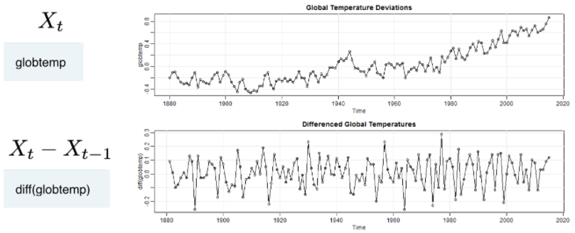
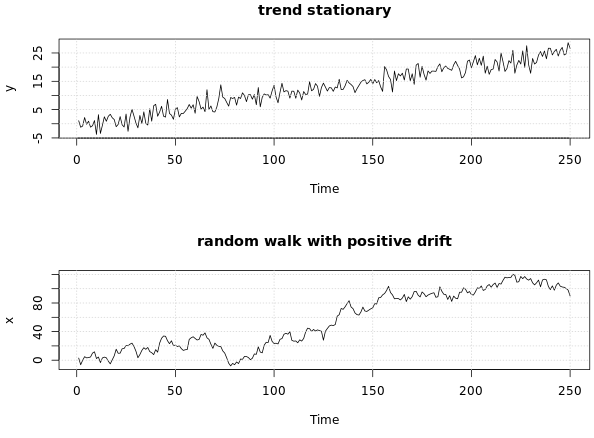

```{r setup, include=FALSE}
knitr::opts_chunk$set(echo = TRUE)

library(astsa)
```

# 

In regression, a dependent variable of Y is regressed by an indepdendent variable X. A curcial assumption in regression is that errors are independent, normal, and homoscedestic. In other words, errors are white noise.

Regression:

> $$Y_{t} = \beta * X_{t} + \epsilon_{t}$$

Time series data are autocorrelated (AR models), meaning yesterday's data (independent variable) is regressed to get today's forecast (dependent variable). 

The AR model:

Today = slope * (yesterday's data) + error

> $$Y_{t} = \phi * Y_{t-1} + \epsilon_{t}$$

Time series data are correlated, meaning yesterday's data is correlated with today's data (and correlation for different lag timestamps will be the same throughout all of the series). However, assuming that the errors are not correlated leads to bad forecasts. One solution to the problem of errors being not correlated is to use the moving average (MA) for the errors. 


MA for the errors:

Error today = WN today + slope * WN yesterday

> $$\epsilon_{t} = WN_{t} + \theta * WN_{t-1}$$

Putting these two together gives us the ARMA model: the model is autoregression with autocorrelated errors.

## Stationarity & Non-stationarity

Staionarity: The mean is constat over time (no trend/drift) and correlation is stable over time (no increase or decrease of correlation among variables at different lags, e.g., correlation at lag 2 for all 2 data points will be ~ same).

{width=50%}

### The random walk (RW) trend

The deviance in the global temperature is a good example of the RW models. The value (the temperature) of the series at time t $$X_{t}$$ is t-1 $$X_{t-1}$$ plus a completely random movement $$\epsilon_{t}$$ (this randomness gives the name random to the random walk). 



Non-stationarity: If there is a trend and heteroscasdicity (the variance in the data is differing at different times), the series in non-stationary. 




To make non-stationary data stationary: 

* Take the log (stabilze the variance)
* Difference the log (de-trend with lags)


```{r}
par(mfrow = c(2,1))

plot(globtemp)
plot(diff(globtemp))
```

```{r}
par(mfrow = c(2,1))

plot(cmort)
plot(diff(cmort))
```

