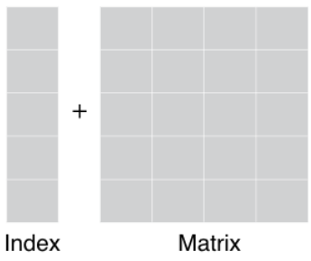
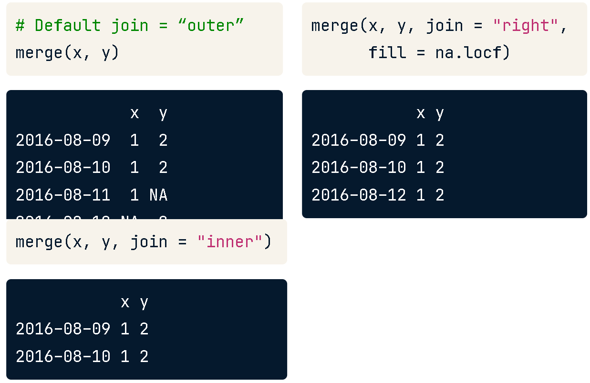
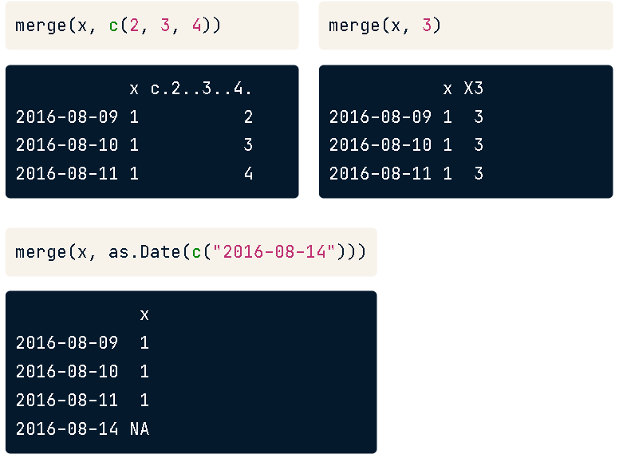
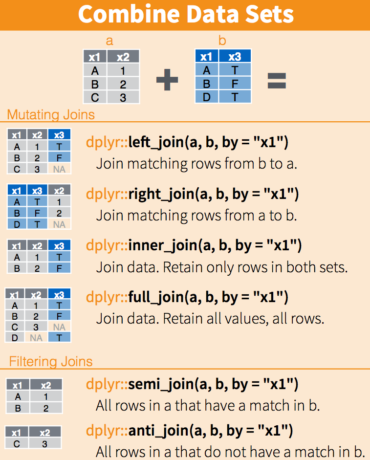
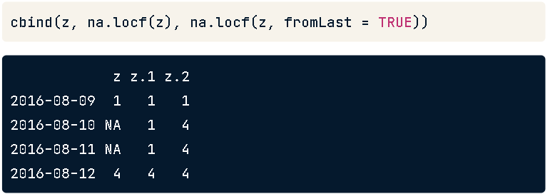
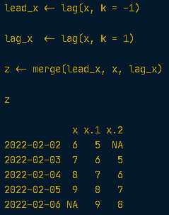
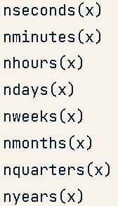

```{r}
knitr::opts_chunk$set(warning = F, message = F,
                      out.width = "400px", out.height = "400px")
```


```{r}
library(dplyr)
library(xts)
```


xts is an eXtensive Time Series.They have the main objects called "zoo" objects= A matrix object + a vector of times. This means an observation of the objects in the matrix in the times in that vector. 

{width=30%}

XTS = matrix + index

Matrix of obsevations

```{r matrix}
x <- matrix(1:4, ncol=2, nrow = 2)
x
```

Index (vector) of times
These must be a time object.

```{r index}
idx <- as.Date(c("2015-01-01", "2015-02-01"))
idx
```

XTS

```{r construct xts}
X <- xts(x,              #x must be matrix or a vector
         order.by = idx) #idx must be increasing time object same length as x
X
```

Birinci gün vektöründe 1 ile 3'üncü gözlemler, ikinci gün vektöründe 2 ile 4'üncü gözlemler yapılmış.

```{r eval=FALSE}
xts(x = NULL,            #an object containing the time series data
    order.by = index(x), #order by vector of times in increasing order of time
    frequency = NULL,    #
    unique = TRUE,       #force times to be unique
    tzone = Sys.getenv("TZ"), #set the time zone
    ) 
    ```

Interestingly, if you take a subset from the matrix, xts will preserve the timestamps if there are any.

XTS içinden matrixi `zoo::coredata(x, fmt=F)`, dateleri almak için `zoo::index(x)` kullanılır. 

# Examples

```{r}
data <- rnorm(15) #create a vector of random 15 numbers

dates <- seq(as.Date("2020-01-01"), #create  a sequence of dates from 
             length = 15,           #for 15 times
             by = "days")           #in days (15 days)


ex <- xts(x = data,            #create a xts from the data matrix
          order.by = dates,    #order by the dates as index
          bday = as.POSIXct("2020-01-01")) #special bday marker in that day

ex
```

Extract the data and the date

```{r}
data_extract <- coredata(ex) 
data_extract

date_extract <- index(ex)
date_extract
```

## Importing, exporting and converting time series

Sunspot verisini `as.xts()` ile xts'e çevirebiliriz. 

```{r}
sunspots_xts <- as.xts(sunspots)
head(sunspots_xts)
```

Bir dosyayı okurken de `as.xts(read.csv())` formatıyla doğrudan xts olarak yükleyebiliriz. 


```{r eval=FALSE}
# Create data by reading tmp_file
data <- read.csv(tmp_file)

# Convert data into xts
xts(data, order.by = as.Date(rownames(dat), "%m/%d/%Y"))

# Read tmp_file using read.zoo and as.xts
data_zoo <- read.zoo(tmp_file, index.column = 0, sep = ",", format = "%m/%d/%Y")

# Read tmp_file using read.zoo and as.xts
data_xts <- as.xts(data_zoo)
```


## The ISO-8601 standard

Bu standart metodda soldan başlanarak sağa doğru tarih büyükten küçüğe yazılır. "YYYY-MM-DD-HH-MM-SS"

```{r}
edhec <- PerformanceAnalytics::edhec
periodicity(edhec)

head(edhec)
```

```{r eval=FALSE}
A["20090825"]       ## Aug 25, 2009
A["201203/201212"]  ## Mar to Dec 2012
A["201601/"]        ## Up to and including January 2016

# Extract all data between 8AM and 10AM
morn_2010 <- irreg["T08:00/T10:00"]

# Extract the observations for January 13th, 2010
morn_2010["2010-01-13"]

#Ama tüm tarihler data["YYYY-MM-DD"] olarak daha net anlaşılır.
```

## Row selection with time objects

POSIXct günü ve saati tutan bir date objesi türüdür. 

Head ve tail fonksiyonlarındaki gibi ilk ve son n veriyi `xts::first()` ve `xts::last()` ile alabiliriz.

```{r}
first(edhec$`Funds of Funds`, #first  
      "3 months")             #3 months
```

```{r}
last(as.xts(edhec$`Funds of Funds`), #last
     n = 4)                          #4 data
```

```{r}
last(edhec$`Funds of Funds`, #last
     "3 years")              #3 years
```

```{r}
first(as.xts(edhec$`Funds of Funds`), 
      "-20 years") #everything but the first 20 years
```

```{r eval=FALSE}
# Extract the first three days of the second week of temps
first(last(first(dat, "2 weeks"), "1 week"), "3 days")
```

```{r}
#Her 1 yılda bir değer göster
edhec[endpoints(edhec,             #son değerler
                k = 1,             #her 1
                on = "years"), 13] #yılda bir
```

```{r}
#Her 2 çeyrekteki bir değer göster
edhec[endpoints(edhec,                #son değerler
                k = 2,                #her 2 
                on = "quarters"), 13] #çeyrekte bir
```

```{r}
head(index(edhec))

xts::tformat(edhec) <- "%d/%m/%Y %H:%M%:%S"
```

```{r eval=FALSE}
# Add a to b, and fill all missing rows of b with 0
a + merge(b, index(a), fill = 0)

# Add a to b and fill NAs with the last observation
a + merge(b, index(a), fill = na.locf)
```


## Merging time series

{width=50%}

{width=50%}

rbind() only excepts dates

```{r eval=FALSE}
# Perform an inner join of a and b
merge(a, b, join = "inner")

# Perform a left-join of a and b, fill missing values with 0
merge(a, b, join = "left", fill = 0)
```

{width=30%}

## Handling missing values

l.o.c.f: last observation carried forward. 

```{r eval=FALSE}
zoo::na.locf(object, 
        na.rm = TRUE,  #delete the observations that don't get filled (NAs followed by an NA)
        fromLast = FALSE, #reverse, take the last observation and carry before
        maxgap = 5)       #fill if > 5 consecutive NAs, < 5 will be unchanged
```


{width=50%}

Diğer NA seçenekleri

```{r eval=FALSE}
zoo::na.fill(object,          #bu objedeki tüm NA değerlerini
             fill = VALUE)    #VALUE ile doldur

zoo::na.trim(object,
             sides = c("left", "right", "both"), #left zaman, right gözlem trim ?
             is.na = c("any", "all"), #içindeki 1 tane değerde bile NA olan satırı silmek için any, tüm değerlerinin NA                                          olduğu satırı silmek için all
             maxgap = n) # n kadar art arda gelen NA değerleri varsa tüm o satırları sil, yoksa bir şey yapma
```

## Leads and Lags

Lead bir gün ileriye almak (a day leading to today)  
Lag bir gün geriye almak (a day lagging from today )  demektir.


Bugünün verisini dünün verisiyle karşılaştırmak için `lag()` operatörü kullanılır. Ne kadar geriye veya ileriye gidileceği `k` değeriyle belirtilir; negatif ise geri, pozitif ise ileri götürür. Birden fazla k değerini birleştirip o tarihlerin damgaları kıyaslanabilir (e.g., 0,1 ve 5 lag/leadleri).  

{width=%50}

R'ın kendi time series(ts) veya zoo verileri için de lag kavramları vardır ama bunlar XTS'e göre ters kodlanır; -1 ile bir ileri lead, 1 ile bir geri lag kodlanır. Bu yüzden ts veya zoo verisini XTS'e çevirdikten sonra ters kodla devam etmek gerekir.

*Diff*

XTS serisindeki farklılıkları (e.g., hisse senedindeki günlük fark) hesaplamak için `diff()` fonksiyonu kullanılır.

```{r eval=FALSE}
diff(xts object,          #
     lag = 1,             #kaç günlüklük fark çıkarılacak (2 gün ise 3-1,4-2,...)
     differences = 1,     #kaç kere uygulanacak
     arithmetic = FALSE,  #değerleri aritmatik dönüşüm
     log = FALSE,         #değerleri logaritmik dönüşüm
     na.pad )       #
```

`diff()` çalışırken bir önceki tarihin verisi bulmak için `lag()` da çalıştırır. 

Seasonality: Kışın sıcaklıkların düşmesi gibi belli olayların belli dönemlerde görülmesi.  
Stationarity: Bir olayın belli bir aralığa sıkışması.

```{r}
head(
  merge(as.xts(AirPassengers), 
        diff(as.xts(AirPassengers), #AirPassanger datasındaki her bir veriyi
             lag = 3,               #3 önceki veri ile 
             differences = 1)),     #1 kere çıkararak ver
  10) 

```

Yukarıdaki `lag(k=3)` çıkarma işlemi satırlarda 4 - 1, 5 - 2 olarak devam ediyor.  


```{r}
periodicity(as.xts(AirPassengers))
```

{width=30%}

```{r}
last5 <- as.xts(AirPassengers)["1955/1960"]   #take the last 5 years
periodicity(last5)
head(last5)

ep <- endpoints(last5, on = "months", k = 6)  #a point every 6 months
ep #it is interesting that every six months is coded as 6*x instead of relevant dates

period.apply(last5,       #on the last5
             INDEX = ep,  #take the index points indicated periods of time in ep
             FUN = mean)  #take the mean of the values for that period

#it'd still work if we just c(0,6,12,18,...)
xd <- c(0,6,12,18)
period.apply(last5, INDEX = xd, FUN = mean)
```

Bütün bu işlemleri tek bir kodla yapmak için `xts::apply.monthly()` veya türevleri olan `xts::apply.yearly()` , `xts::apply.quarterly()`, .. vs kullanılabilir; endpoints işlemlerini kendiliğinden yapar.

```{r}
apply.yearly(last5, mean) #Apply mean on every year point (yearly)
```

*split.xts*

Datayı kendi içinde belli tarih aralıklarına (periodlara) bölmek için kullanılır.

```{r}
head(split.xts(as.xts(AirPassengers), #AirPassanger datasını
          f = "years"))               #Kendi içinde yıllara ayır
```

## Time series aggregation

Belli periodlardaki verilerin aritmatik analizini yaparken mean, max, min vs gibi değerleri hesaplayıp incelemek gerekir.  

* OHLC: Open, High, Low, and Close

> Time series hesaplamalarını yaparken `xts::to.period()` fonksiyonu kullanılır.

```{r eval=FALSE}
to.period(xtsobject, 
          period = "months", #Hangi aralıklarla hesap yapılacak
          k = 1,             #
          indexAt = ,        #Index sırasını periyodun başlangıcında ceya bitişinde ayarlamak istersen
          name = NULL,       #OHLC verilerinin sütunlarının ismini değiştirmek istersen
          OHLC = TRUE)       #
```

```{r}
to.period(edhec["1997/2001", 11], #97-01 edhec datasının ilk sütununda OHLC verisi
          period = "years",       #yıllık periodlarda
          name = "EDHEC")         #EDHEC sütun başlığıyla
```

```{r}
to.period(edhec["1997/2001", 11],
          period = "years",
          OHLC = F)             #OHLC = F sadece Close toplamını verir
```

```{r}
edhec[endpoints(edhec, "years"), 11]
```

```{r}
to.period(edhec["1997/2001", 11], #OHLC bilgilerini
          period = "years",       #yıllık periodlarla
          indexAt = "firstof",    #periyodun başından başlayarak
          name = "EDD")           #EDD ismiyle
```

Her üç ayın verisini hesaplarken 1+2+3, 2+3+4, 3+4+5 diye devam eder.  

> `zoo::rollappy()`: Belli aralıklardaki hesapları tekrarlayarak yapmak

```{r}
rollapply(head(edhec$`Funds of Funds`, 10), #edhec verisinde devinimli hesabı
          width = 3,  #her 3 veride 
          FUN = mean) #ortalamasını al
```


