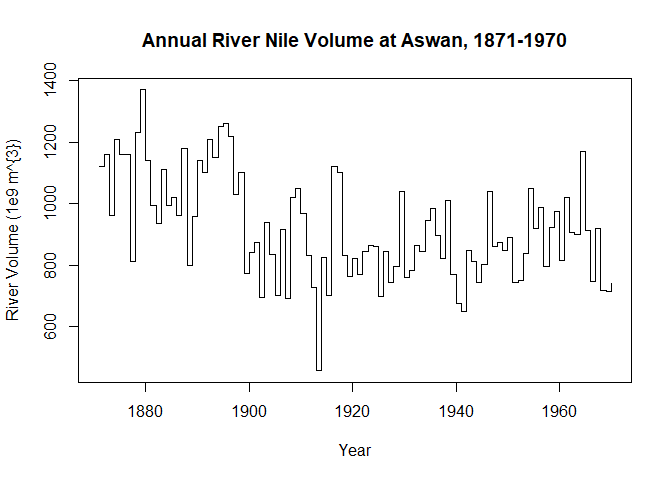
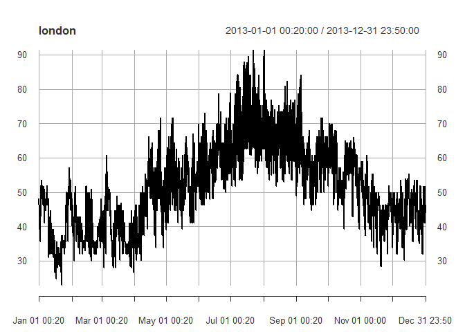
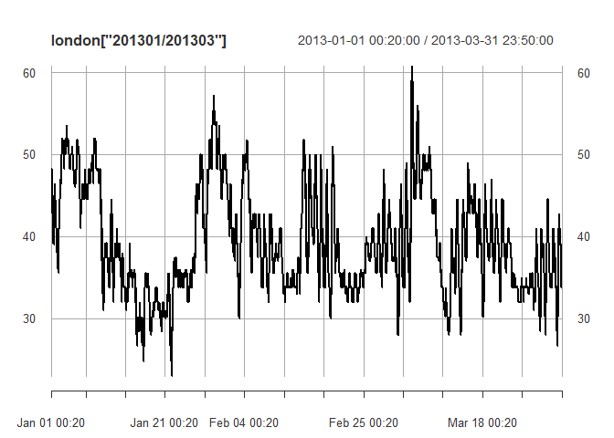
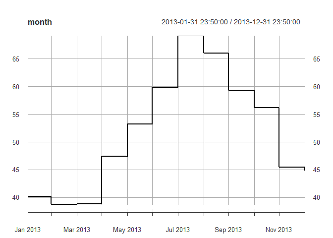
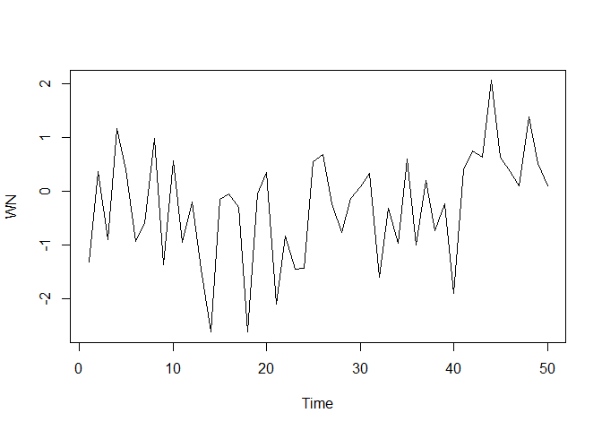
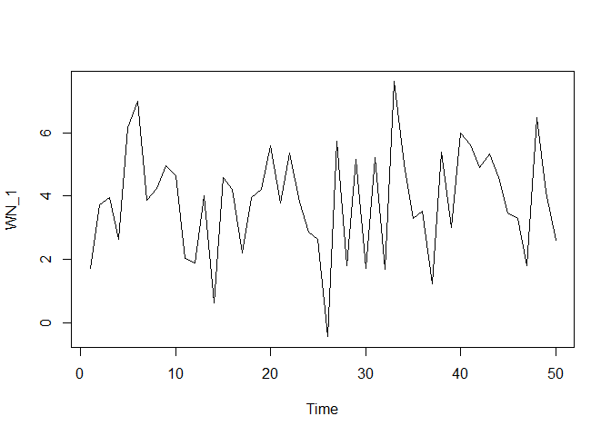

Time Series Analysis
================
IO
09 02 2022

## Dataset

``` r
print(Nile)
```

    ## Time Series:
    ## Start = 1871 
    ## End = 1970 
    ## Frequency = 1 
    ##   [1] 1120 1160  963 1210 1160 1160  813 1230 1370 1140  995  935 1110  994 1020
    ##  [16]  960 1180  799  958 1140 1100 1210 1150 1250 1260 1220 1030 1100  774  840
    ##  [31]  874  694  940  833  701  916  692 1020 1050  969  831  726  456  824  702
    ##  [46] 1120 1100  832  764  821  768  845  864  862  698  845  744  796 1040  759
    ##  [61]  781  865  845  944  984  897  822 1010  771  676  649  846  812  742  801
    ##  [76] 1040  860  874  848  890  744  749  838 1050  918  986  797  923  975  815
    ##  [91] 1020  906  901 1170  912  746  919  718  714  740

``` r
nile <- as.xts(Nile)
head(nile)
```

    ##            [,1]
    ## 1871-01-01 1120
    ## 1872-01-01 1160
    ## 1873-01-01  963
    ## 1874-01-01 1210
    ## 1875-01-01 1160
    ## 1876-01-01 1160

``` r
plot(Nile, 
     xlab = "Year",
     ylab = "River Volume (1e9 m^{3})",
     main = "Annual River Nile Volume at Aswan, 1871-1970",
     type = "s")
```

<!-- -->

``` r
is.ts(nile)
```

    ## [1] FALSE

``` r
is.xts(nile)
```

    ## [1] TRUE

``` r
start(nile)     #starting date of the observations
```

    ## [1] "1871-01-01"

``` r
frequency(nile) #how many observations each day
```

    ## [1] 1

``` r
end(nile)       #last date of observations
```

    ## [1] "1970-01-01"

``` r
deltat(nile)    #time interval between observations in days (how many observations in a day)
```

    ## [1] 1

## London weather data form 2013

We should tranform the data into an xts object

``` r
is.ts(London2013)
```

    ## [1] FALSE

``` r
london <- as.xts(x = London2013$Temperature,
       order.by = lubridate::as_datetime(London2013$Time))

periodicity(london)
```

    ## 30 minute periodicity from 2013-01-01 00:20:00 to 2013-12-31 23:50:00

``` r
plot(london)
```

<!-- -->

``` r
plot(london["201301/201303"])
```

<!-- -->

``` r
plot(xts::first(london, "3 months"))
```

<!-- -->

Differences between every 10 observation

``` r
head(
  merge(london,
        diff(london, 
             lag = 10)),
  20
)
```

    ##                     london diff.london..lag...10.
    ## 2013-01-01 00:20:00   48.2                     NA
    ## 2013-01-01 00:50:00   48.2                     NA
    ## 2013-01-01 01:20:00   48.2                     NA
    ## 2013-01-01 01:50:00   46.4                     NA
    ## 2013-01-01 02:20:00   46.4                     NA
    ## 2013-01-01 02:50:00   46.0                     NA
    ## 2013-01-01 02:50:00   46.4                     NA
    ## 2013-01-01 03:20:00   44.6                     NA
    ## 2013-01-01 03:50:00   44.6                     NA
    ## 2013-01-01 04:20:00   42.8                     NA
    ## 2013-01-01 04:50:00   42.8                   -5.4
    ## 2013-01-01 05:20:00   42.8                   -5.4
    ## 2013-01-01 05:50:00   40.0                   -8.2
    ## 2013-01-01 05:50:00   41.0                   -5.4
    ## 2013-01-01 06:20:00   39.2                   -7.2
    ## 2013-01-01 06:50:00   39.2                   -6.8
    ## 2013-01-01 07:20:00   39.2                   -7.2
    ## 2013-01-01 07:50:00   39.2                   -5.4
    ## 2013-01-01 08:20:00   39.2                   -5.4
    ## 2013-01-01 08:50:00   39.0                   -3.8

Mean Temp of every month

``` r
plot(apply.monthly(london,
              FUN = "mean"),
     type = "s",
     main = "month")
```

<!-- -->

OHLC Values

``` r
to.period(london,
          period = "months")
```

    ##                     london.Open london.High london.Low london.Close
    ## 2013-01-31 23:50:00        48.2        57.2       23.0         46.4
    ## 2013-02-28 23:50:00        46.4        51.8       30.0         35.6
    ## 2013-03-31 23:50:00        35.6        60.8       26.6         33.8
    ## 2013-04-30 23:50:00        33.8        71.6       30.2         42.8
    ## 2013-05-31 23:50:00        42.8        71.6       39.0         59.0
    ## 2013-06-30 23:50:00        57.2        79.0       46.4         57.2
    ## 2013-07-31 23:50:00        55.4        91.4       51.8         68.0
    ## 2013-08-31 23:50:00        68.0        91.4       51.8         57.2
    ## 2013-09-30 23:50:00        55.4        84.2       44.6         55.4
    ## 2013-10-31 23:50:00        55.4        70.0       39.2         55.4
    ## 2013-11-30 23:50:00        55.0        60.8       28.4         35.6
    ## 2013-12-31 23:50:00        35.0        55.4       30.2         46.4

## ARIMA models

ARIMA: AutoRegressive, Integrated Moving Average

We can use ARIMA models to specify white noise (WN) models.

``` r
# Stimulate a WN model with 50 obervations
WN <- arima.sim(model = list(order = c(0,0,0)),
                n = 50)
# This series has a default value of mean and sd, with are 0 and 1
head(WN)
```

    ## [1] -1.3135593  0.3720271 -0.8976360  1.1629635  0.3938114 -0.9359614

``` r
ts.plot(WN)
```

<!-- -->

``` r
# Set the mean and sd of a stimulated WN model
WN_1 <- arima.sim(model = list(order =  c(0,   #Autoregressive order
                                          0,   #Order of integration (differencing)
                                          0)), #Moving average order
                  n = 50,
                  mean = 4,
                  sd = 2)

head(WN_1)
```

    ## [1] 1.725153 3.714982 3.944658 2.641118 6.148909 6.981756

``` r
# We can see this plot has a bigger mean and more variation
ts.plot(WN_1)
```

<!-- -->

### Estimating the white noise in a time series

``` r
arima(WN_1, 
      order = c(0,0,0))
```

    ## 
    ## Call:
    ## arima(x = WN_1, order = c(0, 0, 0))
    ## 
    ## Coefficients:
    ##       intercept
    ##          3.8536
    ## s.e.     0.2379
    ## 
    ## sigma^2 estimated as 2.83:  log likelihood = -96.95,  aic = 197.91

The value that is given as the blank row in under intercept is mean.  
s.e. is the strandard error.  
sigma^2 is indicating the variance in the model. The estimated standard
deviation is the square root of this value.

``` r
mean(WN_1)
```

    ## [1] 3.853575

``` r
var(WN_1)
```

    ## [1] 2.887864
